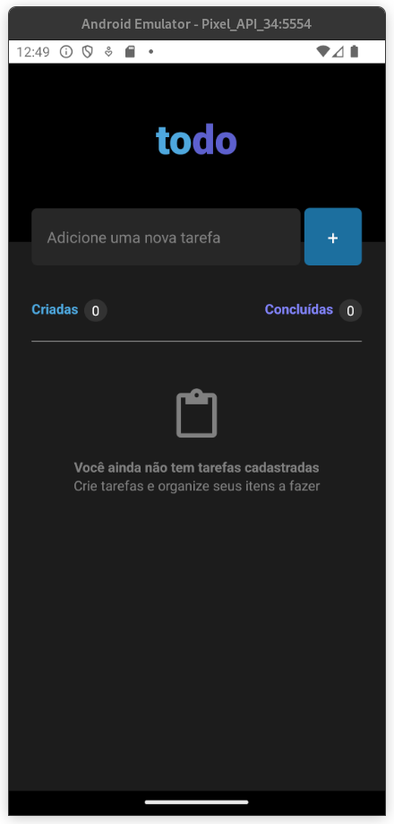
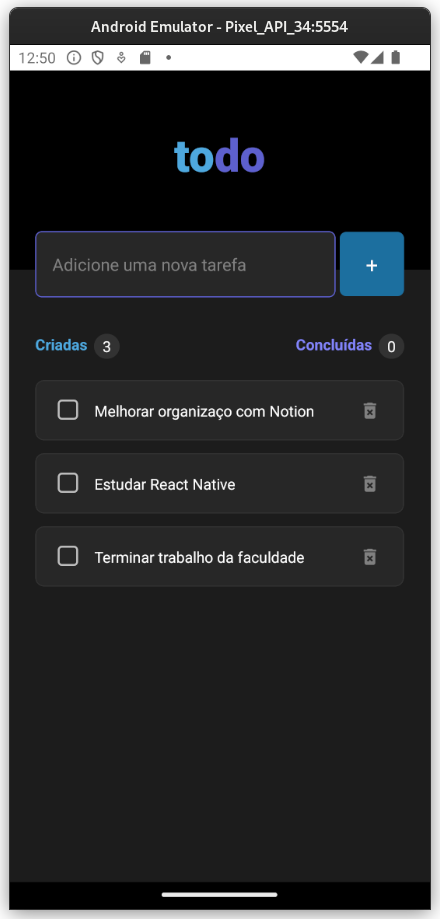

# To-Do List Mobile Application


Este é um aplicativo de lista de tarefas desenvolvido com React Native, onde os usuários podem criar, excluir e marcar tarefas como concluídas. Inicializa algumas tarefas através do arquivo `data.ts` localizado na raiz do projeto, atuando como um mock.


## Screenshots

Aqui estão alguns screenshots do projeto:





## Clone e execução

Para clonar e executar este projeto localmente, siga estas instruções:

1. Clone o repositório:

```bash
git clone https://github.com/gildembergleite/todo-list-mobile.git
```

2. Navegue até o diretório do projeto:

```bash
cd todo-list-mobile
```

3. Instale as dependências:

```bash
npm install
# ou
yarn install
```

1. Inicie o seu emulador de preferência (Android ou IOS):
   

5. Inicie a aplicação no emulador Android:

```bash
npm run android
# ou
yarn android
```

5. Inicie a aplicação no emulador IOS:

```bash
npm run ios
# ou
yarn ios
```

## Contribuindo

Sinta-se à vontade para contribuir com melhorias ou reportar problemas por meio de issues.

## Licença

Este projeto está licenciado sob a Licença MIT - veja o arquivo [LICENSE](LICENSE) para mais detalhes.
